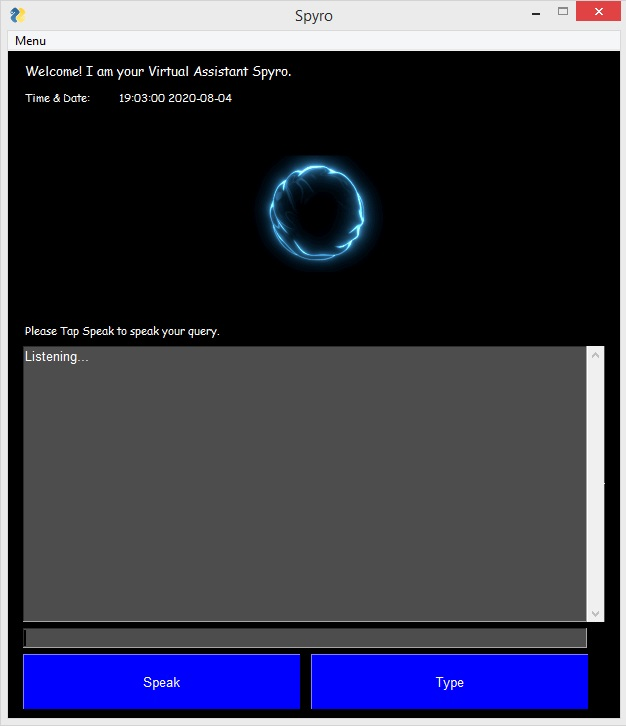

# Virtual Assistant Spyro

Spyro is an virtual voice assistant service. It can understand human speech and perform basic task designed by the client.

When the user specify the appropriate trigger words , The Spyro gets activated and executes the user commands.

Spyro Virtual Voice assistant:"Loading your personal Assistant Spyro.... Hello, Good Morning" (Greets the user according to time)

The implemented Voice assistant can perform the following tasks:

Opens a wepage : Youtube , G-Mail , Google Chrome , StackOverflow
Human : Open Youtube

Human : What is the time

Fetch Top headlines from CNN

Human: what's the latest news?
open cnn page

Captures a photo

Human: Take a photo
Searches data from web

Human: Search Butterfly images from web
Ask geographical and computational questions

Human: What is the capital of California? / Hey Spyro what is Sin 90?
Predict Weather of different Cities

Human: What is the weather likely now in Ljubljana?
Abstarct necessary information from wikipedia

Human: Who is Bob Marley according to Wikipedia
The voice assistant abstarcts first 3 lines of wikipedia and gives the information to the user.

Ask Spyro about what task it can perform and who created it
Human: Who created you? / What can you do

Turn off your pc when required
Human: Please turn off my PC

Tell joke
joke

Show commands
commands

