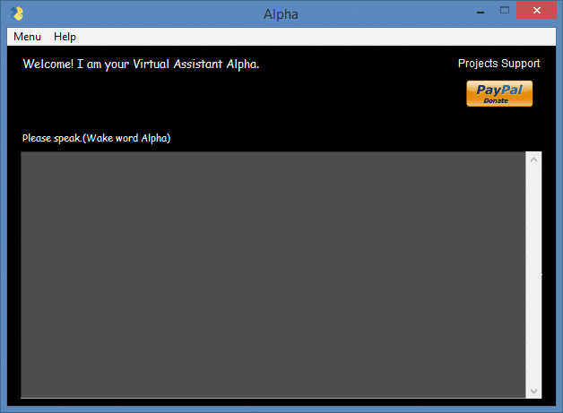

# Virtual Assistant Alpha

[](https://www.python.org/)

[](https://github.com/adrijano/virtual-assistant-Alpha/)

[](https://github.com/adrijano/virtual-assistant-Alpha/graphs/commit-activity)




[](https://www.paypal.com/donate/?cmd=_s-xclick&hosted_button_id=PFB6A6HLAQHC2&source=url)  [](https://commerce.coinbase.com/checkout/149a6235-ec7e-4d3b-a1ae-b08c4f08b4f6)

# If you like it give it a star

[](https://github.com/adrijano/virtual-assistant-Alpha)

# How it works

**Alpha** is a virtual voice assistant service. It can understand human speech and perform basic tasks designed by the client.

When the user specifies the appropriate trigger word "Alpha", Alpha gets activated and executes the user commands.

Alpha `Hello`, `Hi` or `Hey`" (Greets the user according to time)

The implemented Voice assistant can perform the following tasks:


Opens a webpage: Alpha open Youtube, G-Mail, Google Chrome, Facebook - `Open Youtube`

Tell time - `time`

Fetch Top headlines from CNN - `news`
open CNN page

Captures a photo - `Take a photo`

Searches data from web - `Search Butterfly images from the web`

Ask geographical and computational questions, Predict Weather of different Cities - `weather`

The voice assistant abstracts the first 3 lines of Wikipedia and gives the information to the user - `wikipedia`

Ask Alpha about what task it can perform and who created it - `Who created you? / Alpha, What can you do`

Log off your pc when required - `log off or sing out`

Tell joke - `joke`


Show commands - `commands`


# How to use:

### Python3+
```bash
git clone https://github.com/adrijano/virtual-assistant-Alpha.git

cd virtual-assistant-Alpha && pip install -r requirements.txt

python alpha.py
```
**Programmed in Python | PySimpleGUI**


## Donations
If you would like to support me, donations are very welcome.

You can use Paypal to donate using your own credit card. 
The payment is processed by PayPal but you don't need to have a
PayPal account or sign-up for one if you are paying by credit card.

You can also use your own Paypal account to donate.

You can also donate Bitcoin, Bitcoin Cash, Dai, Ethereum, Litecoin and USD Coin.
[](https://www.paypal.com/donate/?cmd=_s-xclick&hosted_button_id=PFB6A6HLAQHC2&source=url)  [](https://commerce.coinbase.com/checkout/149a6235-ec7e-4d3b-a1ae-b08c4f08b4f6)

[](https://github.com/adrijano/virtual-assistant-Alpha/)

